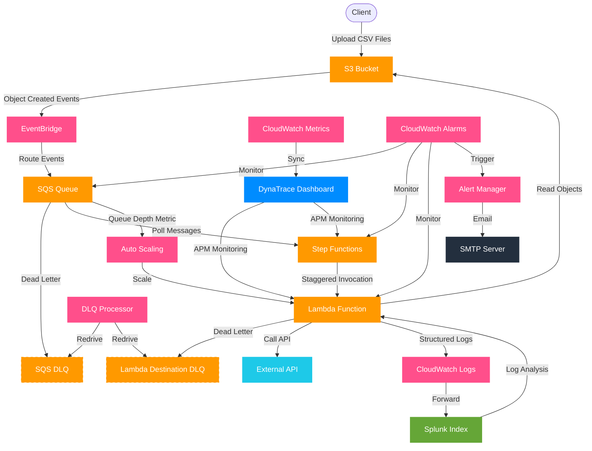

# Architecture Diagram

The following diagram illustrates the complete flow of data through the S3 EventBridge SQS Lambda architecture.

## Architecture Components

### Data Flow Components
- **S3 Bucket**: Storage for uploaded CSV files
- **EventBridge**: Routes S3 object events to SQS
- **SQS Queue**: Buffers events with DLQ for failed deliveries
- **Step Functions**: Orchestrates staggered Lambda invocations
- **Lambda Function**: Processes S3 objects with controlled concurrency

### Monitoring & Observability
- **CloudWatch**: Alarms, metrics, and logs for AWS services
- **Dynatrace**: Primary APM tool for metrics and performance monitoring
- **Splunk**: Primary log analytics platform for Lambda logs
- **SMTP Server**: Central email delivery for notifications

### Reliability Features
- **DLQ Processor**: Handles failed message redriving
- **Auto Scaling**: Adjusts Lambda concurrency based on queue depth

## Key Architectural Patterns

1. **Event-Driven Architecture**: Loosely coupled components communicating via events
2. **Throttled Processing**: Controlled concurrency through Step Functions
3. **At-Least-Once Delivery**: DLQs ensure message delivery reliability
4. **Comprehensive Observability**: Multi-tool monitoring approach
5. **Auto-Scaling**: Dynamic resource allocation based on demand
