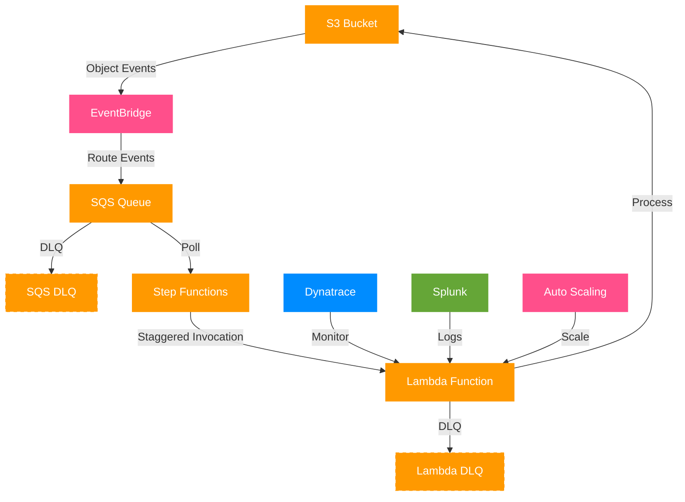

# S3 Event Processor Module

## Overview

The S3 Event Processor module provides a production-ready, reusable pattern for handling S3 object events with staggered Lambda invocations. This battle-tested architecture prevents overwhelming downstream systems by controlling the rate at which Lambda functions are invoked, while providing comprehensive monitoring, reliability features, and performance optimization.

## Architecture



The module implements the following components:

1. **S3 Bucket**: Source of object events (create, update, delete)
2. **EventBridge Rule**: Routes S3 events to SQS with filtering capabilities
3. **SQS Queue**: Buffers events with configurable retention and visibility timeout
4. **Step Functions State Machine**: Provides controlled, staggered invocation pattern
5. **Lambda Function**: Processes S3 objects with auto-scaling capabilities

## Key Features

- **Staggered Invocation**: Prevents overwhelming downstream systems by spacing out Lambda invocations
- **Flexible Configuration**: Easily customize all aspects of the infrastructure
- **High Reliability**: Built-in error handling, retries, and dead letter queues
- **Auto-scaling**: Lambda concurrency scales based on SQS queue depth
- **Monitoring**: Includes CloudWatch alarms and dashboards
- **Reusability**: Works with new or existing S3 buckets

## When to Use This Module

Use this module when:

1. You need to process S3 objects with Lambda functions
2. Your downstream systems can't handle sudden bursts of traffic
3. You need reliable event processing with error handling
4. You want to maintain controlled concurrency

## Implementation Guide

### Prerequisites

- AWS account with appropriate permissions
- Terraform 1.0.0 or newer
- AWS provider 5.0 or newer

### Basic Implementation

```hcl
module "process_images" {
  source = "./modules/s3-event-processor"

  name_prefix = "img-proc"

  # Lambda Configuration
  lambda_function_name = "process-image"
  lambda_handler = "process_image.lambda_handler"
  lambda_runtime = "python3.12"
  lambda_source_dir = "${path.module}/functions"

  tags = {
    Application = "Image Processor"
    Owner       = "Data Team"
  }
}
```

See the [module documentation](../src/terraform/modules/s3-event-processor/README.md) for complete configuration options.

### Lambda Function Requirements

The Lambda function should:

1. Accept an event with S3 details:
   ```json
   {
     "s3_details": {
       "bucket": "my-bucket",
       "key": "path/to/object.jpg"
     }
   }
   ```

2. Implement appropriate error handling
3. Return a response indicating success or failure

Example Python Lambda function:

```python
def lambda_handler(event, context):
    try:
        s3_details = event.get('s3_details', {})
        bucket = s3_details.get('bucket')
        key = s3_details.get('key')

        if not bucket or not key:
            raise ValueError("Missing required S3 details")

        # Process the S3 object
        result = process_object(bucket, key)

        return {
            'statusCode': 200,
            'body': f"Successfully processed {key} from {bucket}",
            'result': result
        }
    except Exception as e:
        return {
            'statusCode': 500,
            'body': f"Error processing object: {str(e)}"
        }
```

## Performance Optimization

To optimize performance:

1. Adjust `lambda_memory_size` and `lambda_timeout` based on your processing needs
2. Configure `step_functions_max_concurrency` to match your downstream capacity
3. Set appropriate `lambda_provisioned_concurrency` to reduce cold starts
4. Use `lambda_scale_based_on_sqs` with `lambda_sqs_messages_per_function` to scale efficiently

## Monitoring and Troubleshooting

The module creates several CloudWatch resources to help with monitoring:

1. **Alarms**: For SQS queue depth, DLQ messages, Lambda errors, and Step Functions failures
2. **Dashboard**: Visualizing the entire pipeline's performance
3. **Logs**: Retained for each component with configurable retention periods

When troubleshooting issues:

1. Check SQS DLQ for messages that couldn't be processed
2. Examine Lambda DLQ for function invocation failures
3. Review Step Functions execution history for bottlenecks or failures
4. Monitor CloudWatch alarms for early warning of issues

## Cost Considerations

The primary cost drivers for this solution are:

1. Lambda invocations and duration
2. Step Functions state transitions
3. SQS API calls and message storage
4. CloudWatch logs storage and alarms

To optimize costs:

1. Adjust Lambda memory allocation to the minimum needed
2. Configure proper timeouts to avoid unnecessary long-running functions
3. Consider batching for very high-volume scenarios
4. Set appropriate log retention periods

## Security Considerations

The module implements several security best practices:

1. Least privilege IAM policies for all components
2. S3 encryption at rest (when creating a new bucket)
3. SQS encryption in transit and at rest
4. CloudWatch logs encryption
5. VPC support for Lambda functions (optional)

Consider these additional security enhancements:

1. Implement VPC endpoints for private network access
2. Add custom KMS keys for encryption
3. Configure more restrictive S3 bucket policies
4. Implement additional logging for security analysis

## Limitations

Be aware of these limitations:

1. Maximum SQS message size (256KB)
2. Lambda execution time limits (15 minutes)
3. Step Functions execution history retention (90 days)
4. EventBridge delivery delays (can be up to minutes)

## Example Use Cases

1. **Image Processing**: Resize and optimize images uploaded to S3
2. **Document Conversion**: Convert documents to different formats
3. **Data Transformation**: Process data files for ETL workflows
4. **Content Moderation**: Scan uploaded content for policy violations
5. **Log Analysis**: Process log files stored in S3

## Getting Support

For issues or questions about this module:

1. Review the module documentation
2. Check the AWS service documentation for underlying services
3. File an issue in the project repository
4. Contact the DevOps team for urgent assistance
