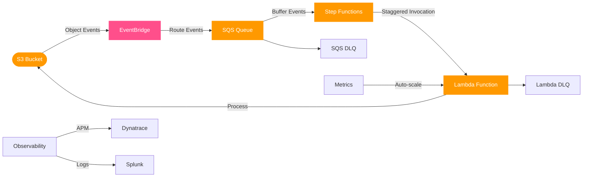

# S3 Event Processor Terraform Module

A production-grade Terraform module implementing a pattern for staggered processing of S3 object events with comprehensive monitoring, auto-scaling, and error handling.

## Overview

This module creates a complete infrastructure for reliably processing S3 bucket events with controlled Lambda concurrency. It routes events through EventBridge to SQS for buffering, with Step Functions orchestrating staggered Lambda invocations to prevent overwhelming downstream systems.

## Features

- **Event Routing**: S3 events → EventBridge → SQS → Step Functions → Lambda
- **Reliability**: Dead letter queues at every step for guaranteed at-least-once delivery
- **Controlled Concurrency**: Configurable staggered Lambda invocations
- **Auto-scaling**: Lambda concurrency scaling based on SQS queue depth
- **Comprehensive Monitoring**: Dynatrace for metrics, Splunk for logs
- **Customizable**: Works with new or existing S3 buckets and Lambda functions

## Architecture



## Monitoring Strategy

This module implements a modern observability strategy:

- **Metrics**: Dynatrace as the primary metric monitoring tool with custom dashboards
- **Logs**: Splunk as the central log analytics platform
- **Alerting**: Critical alerts via a central SMTP server
- **Automation**: Auto-scaling and self-healing capabilities
- **Minimal CloudWatch**: Used only where necessary, with primary monitoring in Dynatrace/Splunk

## Usage

### Basic Usage with New S3 Bucket

```hcl
module "process_images" {
  source = "./modules/s3-event-processor"

  name_prefix = "img-proc"

  # Lambda Configuration
  lambda_function_name = "process-image"
  lambda_handler = "process_image.lambda_handler"
  lambda_runtime = "python3.12"
  lambda_source_dir = "${path.module}/functions"

  # Dynatrace Integration
  enable_dynatrace_integration = true
  generate_dynatrace_dashboard = true
  dynatrace_sync_lambda_arn = module.dynatrace_sync.lambda_arn

  # Splunk Integration
  enable_splunk_integration = true
  splunk_forwarder_lambda_arn = module.splunk_forwarder.lambda_arn
  splunk_index_name = "s3_processor"

  # Minimize CloudWatch usage
  create_dashboard = false

  tags = {
    Application = "Image Processor"
    Owner       = "Data Team"
  }
}
```

### Using with an Existing S3 Bucket

```hcl
module "process_uploads" {
  source = "./modules/s3-event-processor"

  name_prefix = "upload-proc"

  # Use existing S3 bucket
  create_bucket = false
  existing_bucket_id = "my-existing-bucket"
  existing_bucket_arn = "arn:aws:s3:::my-existing-bucket"

  # Lambda Configuration
  lambda_function_name = "process-upload"
  lambda_handler = "process_upload.lambda_handler"
  lambda_runtime = "python3.12"
  lambda_source_dir = "${path.module}/functions"

  # Lambda environment variables for Dynatrace integration
  lambda_environment_variables = {
    LOG_LEVEL = "INFO"
    DT_CUSTOM_PROP = "keptn_project=s3-processor,keptn_service=upload-processor"
    DT_CLUSTER_ID = "s3-processor-cluster"
  }

  # Adjust staggering parameters
  step_functions_max_concurrency = 5

  # Monitoring tools
  enable_dynatrace_integration = true
  enable_splunk_integration = true
  dynatrace_sync_lambda_arn = module.dynatrace_sync.lambda_arn
  splunk_forwarder_lambda_arn = module.splunk_forwarder.lambda_arn
}
```

### Complete Example with Custom Monitoring

```hcl
module "document_processor" {
  source = "./modules/s3-event-processor"

  name_prefix = "doc-proc"

  # S3 Configuration
  s3_enable_versioning = true
  s3_enable_lifecycle_rules = true
  s3_noncurrent_version_expiration_days = 14

  # SQS Configuration
  sqs_queue_name = "document-queue"
  sqs_visibility_timeout_seconds = 600
  sqs_max_receive_count = 5

  # Lambda Configuration
  lambda_function_name = "process-document"
  lambda_handler = "process_document.lambda_handler"
  lambda_runtime = "python3.12"
  lambda_memory_size = 1024
  lambda_timeout = 600
  lambda_source_dir = "${path.module}/functions"

  lambda_environment_variables = {
    LOG_LEVEL = "DEBUG"
    PROCESSOR_MODE = "production"
    # Dynatrace integration environment variables
    DT_CUSTOM_PROP = "keptn_project=doc-processor,keptn_service=document-service"
    DT_CLUSTER_ID = "processor-cluster"
  }

  # Enable autoscaling
  lambda_provisioned_concurrency_enabled = true
  lambda_provisioned_concurrency = 10
  lambda_auto_scaling_enabled = true
  lambda_max_concurrency = 200

  # Step Functions Configuration
  step_functions_name = "process-documents"
  step_functions_max_concurrency = 10
  step_functions_schedule_expression = "rate(30 seconds)"

  # Additional Lambda permissions
  lambda_additional_policies = [
    {
      Effect = "Allow"
      Action = [
        "dynamodb:PutItem",
        "dynamodb:GetItem"
      ]
      Resource = "arn:aws:dynamodb:*:*:table/documents"
    }
  ]

  # Monitoring Configuration

  # Dynatrace as primary metric monitoring tool
  enable_dynatrace_integration = true
  generate_dynatrace_dashboard = true
  dynatrace_sync_lambda_arn = aws_lambda_function.dynatrace_sync.arn

  # Splunk for log analytics
  enable_splunk_integration = true
  splunk_forwarder_lambda_arn = aws_lambda_function.splunk_forwarder.arn
  splunk_index_name = "document_processor"

  # Minimize CloudWatch usage
  create_dashboard = false
  create_alarms = true  # Keep critical alarms only
  log_retention_days = 7  # Minimize CloudWatch log storage

  # Actions for critical alarms
  alarm_actions = ["arn:aws:sns:us-east-1:123456789012:notifications"]

  tags = {
    Application = "Document Processor"
    Environment = "Production"
    Owner       = "Content Team"
  }
}
```

## Requirements

| Name | Version |
|------|---------|
| terraform | >= 1.0.0 |
| aws | ~> 5.0 |

## Inputs

| Name | Description | Type | Default | Required |
|------|-------------|------|---------|:--------:|
| name_prefix | Prefix for resource names | `string` | n/a | yes |
| tags | Tags to apply to all resources | `map(string)` | `{}` | no |
| create_bucket | Whether to create a new S3 bucket or use an existing one | `bool` | `true` | no |
| existing_bucket_id | ID of an existing S3 bucket to use if create_bucket is false | `string` | `null` | no |
| existing_bucket_arn | ARN of an existing S3 bucket to use if create_bucket is false | `string` | `null` | no |
| lambda_function_name | Name of the Lambda function | `string` | n/a | yes |
| lambda_handler | Handler for the Lambda function | `string` | n/a | yes |
| lambda_runtime | Runtime for the Lambda function | `string` | `"python3.12"` | no |
| enable_dynatrace_integration | Whether to enable Dynatrace integration for metric monitoring | `bool` | `true` | no |
| generate_dynatrace_dashboard | Whether to generate a Dynatrace dashboard JSON file | `bool` | `true` | no |
| dynatrace_sync_lambda_arn | ARN of the Lambda function used to sync metrics with Dynatrace | `string` | `null` | no |
| enable_splunk_integration | Whether to enable Splunk integration for log analytics | `bool` | `true` | no |
| splunk_forwarder_lambda_arn | ARN of the Lambda function used to forward logs to Splunk | `string` | `null` | no |
| splunk_index_name | Name of the Splunk index for logs | `string` | `"aws_lambda"` | no |
| step_functions_max_concurrency | Maximum concurrency for the Map state in Step Functions | `number` | `3` | no |

See variables.tf for the complete list of all available variables.

## Outputs

| Name | Description |
|------|-------------|
| bucket_id | The ID of the S3 bucket |
| bucket_arn | The ARN of the S3 bucket |
| queue_url | The URL of the SQS queue |
| queue_arn | The ARN of the SQS queue |
| lambda_function_name | The name of the Lambda function |
| lambda_function_arn | The ARN of the Lambda function |
| state_machine_id | The ID of the Step Functions state machine |
| state_machine_arn | The ARN of the Step Functions state machine |

## Monitoring Implementation

### Dynatrace Integration

This module uses Dynatrace as the primary metric monitoring tool:

1. **Custom Metrics**: The Lambda function includes structured logging with Dynatrace custom metrics
2. **Dashboard Generation**: Generates a Dynatrace dashboard JSON file for importing
3. **Metric Synchronization**: Includes a scheduled EventBridge rule to sync metrics with Dynatrace
4. **Environment Variables**: Supports Dynatrace-specific environment variables for the Lambda function

### Splunk Integration

Splunk is used for log analytics:

1. **Log Forwarding**: CloudWatch logs are forwarded to Splunk via a Lambda forwarder
2. **Log Structure**: Lambda logs use structured JSON format for better parsing in Splunk
3. **Indexing**: Logs are sent to a configurable Splunk index
4. **Filtering**: All relevant log streams (Lambda, Step Functions) are forwarded to Splunk

### Lambda Function Instrumentation

For optimal Dynatrace and Splunk integration, your Lambda code should include structured logging:

```python
logger.info(
    json.dumps({
        "action": "process_complete",
        "bucket": bucket,
        "key": key,
        "rows_processed": len(results),
        "processing_time": processing_time,
        "dt.metrics": {
            "process_success": 1,
            "process_duration": processing_time,
            "rows_processed": len(results)
        }
    })
)
```

## Notes

1. The module minimizes CloudWatch usage outside of Lambda logging
2. Lambda auto-scaling is configured based on SQS queue depth
3. Dead Letter Queues (DLQs) are set up for both the SQS queue and the Lambda function
4. Step Functions includes error handling and retries for reliability
5. The staggered invocation pattern prevents overloading downstream systems by introducing controlled delays between Lambda invocations
6. Dynatrace integration provides comprehensive metric monitoring
7. Splunk integration enables centralized log analytics
8. Structured logging ensures compatibility with both Dynatrace and Splunk
